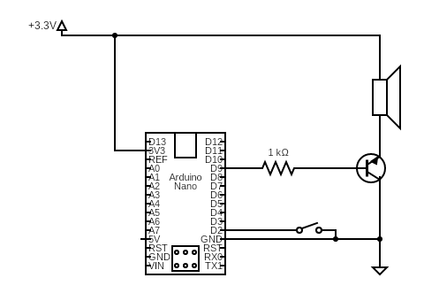

# Mario Box

An Arduino Nano project that plays the Super Mario Bros melody when a button is pressed. The MCU stays in deep sleep (POWER_DOWN) to minimize current draw and wakes via a pin change interrupt.

## Circuit

- **Arduino Nano**
- **Speaker** on pin D9, driven through a 1 kΩ resistor
- **Momentary switch** on pin D2, pulling to ground (uses internal pull-up)
- **Power** from 3.3V

## How It Works

1. The MCU enters `SLEEP_MODE_PWR_DOWN` (~0.1 µA).
2. Pressing the button pulls pin 2 LOW, triggering a pin change interrupt (PCINT18) that wakes the MCU.
3. On the rising edge (button release), the Mario melody plays through the speaker using `tone()`.
4. After playback, the MCU goes back to sleep.

## Files

| File | Description |
|------|-------------|
| `mario-box.ino` | Main sketch — sleep, wake, and playback logic |
| `sounds.h` | `Sequence` class that stores and plays note arrays via `tone()` |
| `sounds.cpp` | Mario melody definition (frequencies and durations) |
