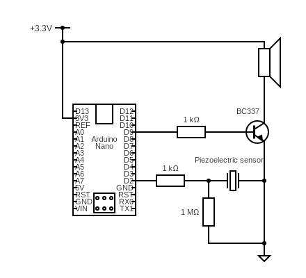

# Mario Box

An Arduino Nano project that plays the Super Mario Bros melody when triggered. The MCU stays in deep sleep (`POWER_DOWN`) to minimize current draw and wakes via a pin change interrupt on pin D2.

Trigger mode is selected at compile time with `PIEZO_ENABLED` in `mario-box.ino`:

| `PIEZO_ENABLED` | Trigger | Behavior |
|-----------------|---------|----------|
| `false` | Micro switch | Wake on press; play on release |
| `true` | Piezo sensor | Wake on hit; play immediately, then cooldown |

## Circuit

### Micro switch

- **Micro switch** on pin D2, pulling to ground (uses internal pull-up)

### Piezo sensor 

- **Piezo** center (+) → series ~1–10 kΩ → D2; ~1 MΩ bleed from center to GND; brass (−) to GND
- Idle level is LOW via the external bleed resistor (`INPUT`, no pull-up)

### Shared

- **Arduino Nano** (or Pro Mini 3.3V / 8 MHz)
- **Speaker** on pin D9, driven through a BC337 transistor
- **Power** from 3.3V

## How It Works

1. The MCU enters `SLEEP_MODE_PWR_DOWN` (~0.1 µA).
2. A pin change on D2 (`PCINT18`) wakes the MCU.
3. **Switch mode:** after a short debounce, playback starts when D2 is HIGH (button released).
4. **Piezo mode:** playback starts on wake; a cooldown (`PIEZO_COOLDOWN_MS`) ignores further wakes so speaker vibration does not re-trigger the sensor.
5. After playback, the MCU goes back to sleep.

## Files

| File | Description |
|------|-------------|
| `mario-box.ino` | Main sketch — sleep, wake, and playback logic (`PIEZO_ENABLED`) |
| `sounds.h` | `Sequence` class that stores and plays note arrays via `tone()` |
| `sounds.cpp` | Mario melody definition (frequencies and durations) |
